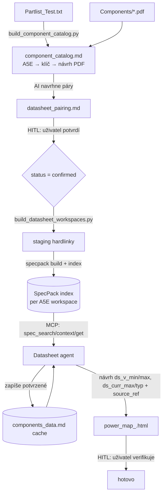

# Datasheet HowTo — práce s datasheety (od Partlistu po `ds_*` v power_map)

> **Účel:** jedno místo, které drží celý průchozí postup manipulace s datasheety, aby se
> workflow neztratilo. Detaily jednotlivých kroků jsou v odkazovaných souborech; tady je
> **mapa procesu**, pořadí kroků, příkazy a kontrolní body (HITL).
>
> Zásady projektu platí i tady: **source of truth = editace uživatele**, **no guessing**
> (systém navrhuje + metodiku, uživatel schvaluje), **offline** (jen dodané datasheety).

---

## 0. Kde co leží (rozcestník)

| Artefakt | Umístění | Kdo tvoří | Přežije regeneraci? |
|---|---|---|---|
| Datasheety (PDF) | `Data/<projekt>/Components/` (junction) | uživatel | ano |
| Katalog komponent | `Data/<projekt>/<datum>/component_catalog.md` | `build_component_catalog.py` | **ne** (regeneruje se) |
| Párování datasheet↔A5E | `Data/<projekt>/<datum>/datasheet_pairing.md` | AI navrhne, **uživatel potvrdí** | **ano** (HITL source of truth) |
| Staging (hardlinky PDF) | `D:\Code\Tools\specPack\staging` | `build_datasheet_workspaces.py` | přestavuje se |
| SpecPack index | `D:\Code\Tools\specPack\workspaces` (sdílený root) | `build_datasheet_workspaces.py` | přestavuje se |
| Cache datasheetových dat | `Data/components_data.md` (globální) | Datasheet agent | ano |
| `ds_*` hodnoty | `power_map_<projekt>.html` | Datasheet agent + HITL | ano |

Podrobná mechanika a příkazy: [python/README.md](python/README.md).
Doménová znalost (filtr, konvence): [skills/cr8000-power-domain/SKILL.md](skills/cr8000-power-domain/SKILL.md).
Zadání a datový model: [Description.md](Description.md) (kap. 2.3, 8, 9).
Provozní poznámky k SpecPack MCP (gotchas): repo paměť `/memories/repo/specpack-mcp.md`.

---

## 1. Přehled procesu



Krátce: **katalog → párování (HITL) → staging+index → dotaz přes MCP → `ds_*` do power_map (HITL) → cache.**

---

## 2. Krok za krokem

### Krok 1 — Katalog komponent (deterministicky, bez LLM)
Sloučí Partlist na unikátní komponenty per `A5E`, přiřadí klíč `A5E<num>__<SLUG(COMMENT)>`
a **navrhne** párování s PDF ve složce `Components/`.

- **Spuštění:** *Tasks: Run Task* → `Katalog: Partlist → component_catalog.md`
- Nebo z terminálu:
  ```powershell
  $py = "C:\Users\z003z5xd\AppData\Local\Programs\Python\Python311\python.exe"
  & $py python\build_component_catalog.py
  ```
- **Výstup:** `component_catalog.md` vedle Partlistu. Sloupec `datasheets`:
  `✓` = A5E přímo v názvu souboru (silná shoda), `?` = shoda dle MPN (jen návrh → HITL).
- **Pozor:** tento soubor se **regeneruje**, ruční editace do něj nepatří — patří do párování (krok 2).

Detaily: [python/README.md](python/README.md) → *Katalog komponent*.

### Krok 2 — Párování datasheet ↔ A5E (HITL, source of truth)
Autoritativní tabulka, která přežije regeneraci katalogu. AI navrhuje, **uživatel rozhoduje**.

- **Soubor:** [Data/MCP1x10/20260825/datasheet_pairing.md](Data/MCP1x10/20260825/datasheet_pairing.md)
- **Statusy:**
  - `confirmed` — potvrzeno, jde do stagingu/indexu.
  - `proposed` — návrh AI, čeká na tvé rozhodnutí (přepiš na `confirmed` / `rejected`).
  - `rejected` — nepárovat.
- **Více PDF na 1 komponentu** = více řádků se stejným `a5e` (např. procesor: datasheet +
  reference manual + HW design guide) → sloučí se do jednoho workspace.
- **Osiřelá / future PDF** (bez protějšku v Partlistu) se vypisují zvlášť a **nestagují se**.
- Cesty v tabulce jsou relativní k `Data/<projekt>/Components/`.

> **Kontrolní bod HITL:** jen řádky se statusem `confirmed` se dostanou do indexu.
> Bez potvrzení se nic nestaví — to je záměr (no guessing).

### Krok 3 — Staging + SpecPack index (deterministicky, bez LLM)
Z potvrzených párů vytvoří staging s **hardlinky** (bez kopií) a spustí per-komponentní
`specpack build` + `index` do sdíleného globálního rootu. 1 workspace = 1 A5E komponenta.

- **Spuštění:** *Tasks: Run Task* →
  - `SpecPack: Build & Index datasheets` (inkrementální),
  - `SpecPack: Full rebuild datasheets` (plný rebuild).
- Nebo z terminálu:
  ```powershell
  $py = "C:\Users\z003z5xd\AppData\Local\Programs\Python\Python311\python.exe"
  & $py python\build_datasheet_workspaces.py            # build + index
  & $py python\build_datasheet_workspaces.py --full     # plný rebuild
  & $py python\build_datasheet_workspaces.py --no-build # jen staging + config
  ```
- **Výsledek:** index dostupný přes MCP server `specpack` (`.vscode/mcp.json`).

> **Gotcha (MCP discovery):** server skenuje root na `**/specpack.db`. Přejmenování/přesun
> složek workspaces se projeví **až po restartu** MCP serveru (reload okna VS Code / další
> MCP volání). Další provozní pasti (mcp<2, PYMUPDF_MESSAGE) viz `/memories/repo/specpack-mcp.md`.

### Krok 4 — Dotaz přes MCP a doplnění `ds_*` (AI + HITL)
Datasheet agent čte index přes MCP a navrhuje hodnoty do `power_map`.

- **MCP nástroje:** `spec_search` (najdi), `spec_context` (kontext kolem), `spec_get` (vytáhni).
  Volitelně `spec_list_workspaces` pro přehled dostupných komponent.
- **Co agent plní:**
  - `ds_v_min` / `ds_v_max` — z **Operating conditions** (NE „Absolute Maximum Ratings").
  - `ds_curr_max` / `ds_curr_typ` [mA] — při nejednoznačnosti **navrhne hodnotu + metodiku**
    a označí k verifikaci. `ds_curr_typ` = derating dle podmínek (koeficient může dodat uživatel).
  - `source` / `source_ref` — datasheet, revize, datum, strana/tabulka.
- **Cache first:** před parsováním agent ověří `Data/components_data.md` dle `a5e`; pokud
  komponenta v cache je, **použije se cache** a parsování se přeskočí.

> **Kontrolní bod HITL:** navržené `ds_*` musí verifikovat uživatel (preprocessing -B-,
> [Description.md](Description.md) kap. 10). Nesoulad `rail_v` ∈ ⟨`ds_v_min`, `ds_v_max`⟩ → `⚠️`.

Detaily role agenta: [.github/agents/datasheet.agent.md](.github/agents/datasheet.agent.md).

---

## 3. Typické situace

- **Přišel nový datasheet:** vlož PDF do `Components/<kategorie>/`, spusť krok 1 (katalog),
  potvrď pár v kroku 2, spusť krok 3 (index). Pak krok 4 doplní `ds_*`.
- **Komponenta má víc PDF:** přidej víc řádků se stejným `a5e` do párování (status `confirmed`)
  → sloučí se do jednoho workspace.
- **Datasheet chybí:** systém upozorní, uživatel PDF dodá do `Components/` a proces se opakuje.
- **Náhrada součástky** (např. VHC→AHC): zapiš do sekce „Rozhodnuto (uživatel)" v párování
  a nastav `confirmed` s poznámkou.
- **PDF bez protějšku v Partlistu:** nech v sekci „Osiřelá / future" — nestaguje se.

---

## 4. Co NEdělat

- Needituj `component_catalog.md` ručně — **regeneruje se**. Rozhodnutí patří do `datasheet_pairing.md`.
- Nepoužívej `build_specpack_index.py` (`--per-doc`) pro nové běhy — **DEPRECATED** (ošklivá
  per-datasheet jména). Výchozí je per-komponenta (`build_datasheet_workspaces.py`).
- Neber hodnoty z „Absolute Maximum Ratings" pro `ds_v_min/max` — jen z Operating conditions.
- Nehádej `ds_curr_*` — navrhni + metodiku a nech verifikovat (no guessing).

---

## 5. Odkazy

- Mechanika a příkazy: [python/README.md](python/README.md)
- Zadání / datový model / cache: [Description.md](Description.md) (kap. 2.3, 8, 9, 10)
- Párování (HITL): [Data/MCP1x10/20260825/datasheet_pairing.md](Data/MCP1x10/20260825/datasheet_pairing.md)
- Datasheet agent: [.github/agents/datasheet.agent.md](.github/agents/datasheet.agent.md)
- Doménová znalost: [skills/cr8000-power-domain/SKILL.md](skills/cr8000-power-domain/SKILL.md)
- Provozní gotchas SpecPack MCP: repo paměť `/memories/repo/specpack-mcp.md`
