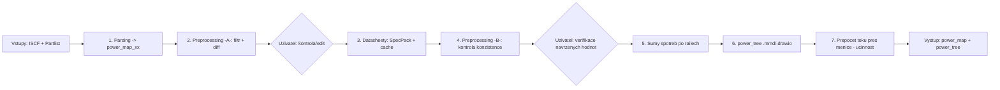
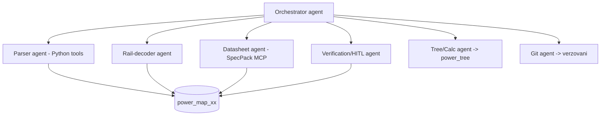

# CR8000-to-PS_Spec — Zadání projektu

> Nástroj (cílově sada VS Code Copilot **Skills + Agents + Python skriptů + MCP serverů**), který
> ze zadaných podkladů z CAD systému **CR8000** vytvoří **mapu napájecí soustavy** elektronického
> produktu, dopočítá spotřeby na jednotlivých napájecích hladinách (railech) a v kaskádě je
> agreguje až po vstupní napájecí hladinu (nejčastěji 24 V). Výstupem je editovatelná
> `power_map` a blokové schéma napájecí soustavy (`power_tree`).

- **Vlastník projektu (human):** Lubor
- **Jazyk:** dokumentace česky, kód a identifikátory anglicky
- **Cílová platforma:** VS Code + GitHub Copilot (agenti, skills), Python 3.11, MCP servery
- **Python 3.11:** `C:\Users\z003z5xd\AppData\Local\Programs\Python\Python311\`
- **Zásada č. 1 (source of truth):** editace uživatele má vždy přednost před výpočtem AI.
- **Zásada č. 2 (no guessing):** pokud výstup není deterministický, systém **nehádá** —
  navrhne hodnotu + metodiku a vyžádá si verifikaci/doplnění od uživatele.
- **Zásada č. 3 (offline):** vyhledávání na internetu **není povoleno**; zdrojem dat jsou
  výhradně dodané podklady a datasheety.

---

## 1. Kontext a cíl

Designér v CR8000 exportuje podklady, systém z nich sestaví přehled, kdo (které součástky) a
kolik proudu odebírá na jednotlivých railech. Cílem je:

1. Deterministicky spárovat data ze dvou vstupních textových souborů (ISCF + Partlist).
2. Dekódovat napěťové hladiny railů.
3. Odfiltrovat součástky se zanedbatelnou spotřebou (blokovací kondenzátory, pull-up/pull-down…).
4. Z datasheetů doplnit provozní napětí a proudy relevantních spotřebičů.
5. Zkontrolovat konzistenci (napětí railu vs. rozsah v datasheetu apod.).
6. Sečíst spotřeby po railech a přepočítat energetické toky přes měniče/regulátory až ke vstupu.
7. Vygenerovat blokové schéma napájecí soustavy (`power_tree`).

Specifikace vstupního napětí produktu je v `Documents/RBHW_a3_Version_12.1.pdf`.

---

## 2. Vstupy

Vstupy vytváří **uživatel** exportem v CR8000 Design Editor → `Tool` → `Netlist Processor` →
výběr z menu `Output Format`. **Není to práce AI.**

### 2.1 ISCF — Intel Schematic Connectivity Format
- Testovací soubor: `Data/MCP1x10/20260825/ISCF.txt`
- Klíčové sekce (párové značky `BEGIN_*` / `END_*`):

| Sekce | Význam | Formát řádku |
|---|---|---|
| `BEGIN_COMPPROPS` | vlastnosti součástek | `RefDes:partName,partNumber,noMount,tolerance,value,maxV,powerDiss,maxP,elec_type,enetNonSeries,componentKind,power_supply,compComment` |
| `BEGIN_BUSES` | sběrnice | (nepoužíváme) |
| `BEGIN_NETS` | signálové nety | `NetName:RefDes(pin:pinLabel),...;` |
| `BEGIN_GROUND` | zemní nety | `NetName:RefDes(pin:pinLabel),...;` |
| `BEGIN_POWER` | **napájecí raily** | `RailName:RefDes(pin:pinLabel),...;` |

- **`BEGIN_POWER`** je hlavní zdroj railů a jejich připojených pinů.
  Příklad: `P3V3:...,D1202(8:VCC),...,D9(20:VCC),...;`
- **`BEGIN_COMPPROPS`** poskytuje `A5E` (partName), `componentKind` (typ pouzdra/třídy)
  a pole **`power_supply`** pro křížovou kontrolu.
  Příklady:
  - `D1202:A5E00063809,,,,,,,,,,104,VCC=P3V3;GND=GND,`
  - `D8:A5E56245815,,,,,,,,,,104,VDD1=VCC;VDD2=VCC;VDDQ=VCC;VSS=GND,`
  - `D1201:A5E47026826,,,,,,,,,,104,,` (bez `power_supply` — jiný způsob připojení, není chyba)

> **Poznámka k `componentKind`:** kódy (`102`, `103`, `104`, …) reprezentují třídu součástky
> (např. `103` = kondenzátor). Doporučuji je využít jako primární signál pro inteligentní filtr
> (kap. 6) místo hádání z názvu. **Kompletní číselník kódů je otevřený bod — viz kap. 13.**

### 2.2 Partlist (Testway BOM)
- Testovací soubor: `Data/MCP1x10/20260825/Partlist_Test.txt`
- Oddělovač `|`, hlavička: `#ARTIKEL|EPL|TYPE|COMMENT|Value|Tolerance|Voltage|`

| Pole | Popis | Použití |
|---|---|---|
| `ARTIKEL` | A5E číslo — jednoznačný identifikátor materiálu v PLM (TeamCenter) | klíč, spojení přes A5E |
| `EPL` | referenční značení ve schématu = **RefDes** | **klíč pro spojení s ISCF** |
| `TYPE` | typ součástky (např. `74LVC244`) | atribut (může být prázdný) |
| `COMMENT` | značení v TeamCenter (např. `IC_INTERFACE_74LVC244_1.65V-3.6V_TSSOP-2`) → **Item** | atribut |
| `Value` | hodnota (R, C…) | atribut |
| `Tolerance` | tolerance | atribut |
| `Voltage` | napětí (zejm. kondenzátory) | atribut |

> Parsujeme **celý BOM** (i pole, která teď nepotřebujeme — mohou se hodit později).

> **Pozor na kódování / diakritiku** u `COMMENT`. Příklad chyby:
> `IC_DDR4_128MB_x16_+95A??C_BGA_200` má být `IC_DDR4_128MB_x16_+95°C_BGA_200`.
> Nutná normalizace kódování (viz kap. 13, otevřený bod — detekce zdrojového kódování).

### 2.3 Datasheety
- Uživatel je dodává do `Data/MCP1x10/datasheets/…` (možné podsložky, konvence zatím volná).
- Parsování přes **SpecPack PDF MCP server** (viz kap. 9).
- Pokud systém potřebný datasheet nenajde → upozorní uživatele, ten jej dodá.

### 2.4 Externí zátěže
- Data, která **nejsou** v podkladech (např. odběr přes konektor do externí zátěže), dodává
  uživatel v souboru `Data/<projekt>/<datum>/Ext_loads.md` (šablona ve verzním adresáři).

---

## 3. Výstupy

| Soubor | Umístění | Popis |
|---|---|---|
| `power_map_xx` | vedle zdrojových dat (`Data/<projekt>/<datum>/`) | hlavní editovatelná mapa (formát dle rozhodnutí — viz kap. 4) |
| `power_tree_xx.mmd` | tamtéž | blokové schéma (Mermaid) |
| `power_tree_xx.drawio` | tamtéž | blokové schéma (draw.io) |
| `Ext_loads.md` | `Data/<projekt>/<datum>/` | vstup od uživatele pro externí zátěže |
| `components_data.md` | `Data/` (globálně) | cache naparsovaných datasheetových dat (viz kap. 9) |

`xx` = jméno projektu (např. `MCP1x10`). Data konkrétní verze schématu žijí v
`Data/<projekt>/<datum>/`; obecné (skripty, skills, agenti, globální cache) v kořeni repa.

---

## 4. Datový model `power_map` (rozhodnutí formátu)

Vzor v zadání používá tři „dílčí tabulky" na jeden řádek součástky. Sjednocuji je do **jednoho
širokého záznamu** na kombinaci `(RefDes, Rail)`. Multi-rail součástka (např. DDR `D8`) má tedy
**více řádků** — jeden na rail. Je-li součástka na jednom railu připojena víc piny (např. víc
`VCC` pinů), sloučí se do **jedné buňky** `pin` (jeden pin na řádek buňky).

### 4.1 Schéma sloupců

| Sloupec | Zdroj | Jednotka | Poznámka |
|---|---|---|---|
| `check` | systém | — | stav: prázdné / ⚠️ (nesoulad) |
| `power_state` | filtr (kap. 6) | — | ✅ počítá se / ⛔ zanedbatelné / *uzel* — blok toku energie (LDO/DC-DC, pojistky, feritové perly…, zpracuje `power_tree`) |
| `rail` | ISCF `BEGIN_POWER` | — | název railu |
| `rail_v` | dekodér (kap. 5) | V | hodnota napětí railu |
| `refdes` | ISCF (= Partlist `EPL`) | — | referenční značení |
| `pin` | ISCF `BEGIN_POWER` | — | `pin:pinLabel`, např. `8:VCC` |
| `a5e` | Partlist `ARTIKEL` | — | dohledáno dle `refdes` |
| `type` | Partlist `TYPE` | — | může být prázdné |
| `item` | Partlist `COMMENT` | — | normalizovaná diakritika |
| `value` | Partlist `Value` | — | může být prázdné |
| `tolerance` | Partlist `Tolerance` | — | může být prázdné |
| `voltage` | Partlist `Voltage` | — | může být prázdné |
| `ds_v_min` | datasheet | V | Operating conditions (ne Absolute Max) |
| `ds_v_max` | datasheet | V | Operating conditions (ne Absolute Max) |
| `ds_curr_max` | datasheet | mA | max. napájecí proud |
| `ds_curr_typ` | datasheet / derating | mA | typický proud (koeficient od uživatele) |
| `source` | systém | — | odkaz na zdroj hodnot (datasheet + str./tabulka) / „user" |

### 4.2 Formát: **HTML** (rozhodnuto)
Zvolený formát `power_map` je **HTML** — jako jediný je v Chrome zároveň dobře čitelný
(renderovaná tabulka) i editovatelný. Markdown je sice zobrazitelný i ve VS Code, ale editovatelný
je jen hrubý zdroj — čitelné Preview editovat nejde. XML se v prohlížeči zobrazí jen jako kód.

Ukázky (v `Data/MCP1x10/20260825/`), stejné 3 vzorové záznamy:
- `power_map_MCP1x10.sample.html` — **zvolený formát**
- `power_map_MCP1x10.sample.md` — jen pro srovnání
- `power_map_MCP1x10.sample.xml` — jen pro srovnání (zavrženo)

> **HTML chování:** ukázkový `*.sample.html` renderuje tabulku, buňky jsou přímo přepisovatelné
> (`contenteditable`) a lze ho uložit zpět do souboru přes File System Access API (tlačítko
> „Uložit“), s fallbackem na stažení. CSV záměrně vynecháno (otravný import/export přes Excel).

Serializace v kroku 1 bude generovat `power_map_xx.html`.

---

## 5. Dekódování napětí railu (`rail_v`)

Strategie v pořadí priorit:

1. **Konvence `PxVy` v názvu** → deterministicky:
   `P5`→5 V, `P12`→12 V, `P3V3`→3.3 V, `P0V85`→0.85 V.
2. **Prefix/suffix konvence** i ve složitějších názvech:
   `NVCC_BBSM_P1V8`→1.8 V, `SNVS_P0V8`→0.8 V, `VDDIO_P1V8`→1.8 V.
3. **Trasování topologie** pro názvy bez konvence (např. `VDDAH_PHY`):
   sledovat vazbu přes feritovou perlu / spínací prvek / rezistor malé hodnoty na napájecí rail
   (zde `P3V3`) a odtud odvodit hodnotu.
4. **Dotaz na uživatele**, pokud vazba není nalezena nebo výsledek není deterministický
   (např. `VDD2`, `VDDQ`). Systém **nehádá**.

Výsledek trasování (bod 3) se označí jako odvozený a nabídne k verifikaci.

---

## 6. Inteligentní filtr spotřeby (preprocessing -A-)

- **Cíl:** označit součástky se zanedbatelnou/nulovou spotřebou (blokovací kondenzátory,
  pull-up/pull-down rezistory…) → `⛔`, ostatní → `✅` (počítají se do spotřeby).
- **Primární signál:** `componentKind` z ISCF (číselník DE/EN/CZ v `skills/cr8000-power-domain/SKILL.md`,
  ověřený proti datům) + typ/hodnota z BOM.
- **Konfigurovatelnost:**
  - parametry filtru (co se zařadí / co se filtruje),
  - filtr lze **zapnout/vypnout**,
  - vyfiltrované položky lze **zobrazit/potlačit**.
- **Speciální případy** (nepočítat jako prostý spotřebič, ale jako uzel/blok toku energie):
  - LDO, DC/DC konvertory, spínače napájení (diskrétní i integrované) — vstupní i výstupní rail,
    na výstupu může být i obecný Net.
  - feritové perly, pojistky, rezistory „malé" hodnoty — sériové prvky v cestě.
  - konektory s externí zátěží — data dodá uživatel (`Ext_loads.md`).
  - LED — spotřeba z typu (úbytek), railu a sériového rezistoru; obv. přes driver / OC tranzistor.

- **Komparace s předchozí verzí (diff):** zpracovat rozdíl proti předchozí verzi `power_map` a
  **převzít beze změny** položky, které se nezměnily (zachovat ruční editace a datasheetová data).
  → *Návrh mechanismu v kap. 12; detaily otevřený bod (kap. 13).*

- Výsledný soubor kontroluje/edituje uživatel a uloží k dalšímu zpracování (**source of truth**).

---

## 7. Křížová kontrola připojení (deterministická)

Pro každý řádek `(RefDes, Rail, Pin)`:
1. `Rail` a `Pin` se získají z `BEGIN_POWER`, parsují dle `RefDes`
   (např. `D1202(8:VCC)` → pin `8`, label `VCC`).
2. V `BEGIN_COMPPROPS` se dle `RefDes` najde pole `power_supply`
   (např. `VCC=P3V3;GND=GND`) a ověří se **shoda** railu.
   - Multi-rail: `D8:...,VDD1=VCC;VDD2=VCC;VDDQ=VCC;VSS=GND` (interní názvy ≠ názvy netů — OK).
   - Prázdné `power_supply` **není chyba** (jiný způsob připojení ve schématu).
   - **Rozpor** typu `P3V3` vs. `P1V8` → `⚠️` a hlášení uživateli.
3. `A5E`, `Type`, `Item`, `Value`, `Tolerance`, `Voltage` se dohledají v Partlistu dle `RefDes`.

---

## 8. Doplnění dat z datasheetů (preprocessing = krok 3)

- `ds_v_min`, `ds_v_max`: z **Operating conditions** (NE „Absolute Maximum Ratings").
- `ds_curr_max`, `ds_curr_typ` [mA]: často nejednoznačné (závislost na napětí, frekvenci, režimu).
  - Systém smí **navrhnout** hodnotu + **metodiku**, jak k ní došel; hodnota musí být verifikována.
  - `ds_curr_typ` = derating dle konkrétních podmínek (např. poměr standby/aktivní čas u EEPROM);
    koeficient může poskytnout uživatel. **AI navrhuje, uživatel schvaluje/koriguje.**
- Při nejistotě o správnosti → explicitní upozornění na verifikaci / ruční dohledání.

---

## 9. SpecPack PDF — MCP server

> **Průchozí návod celého datasheet workflow** (katalog → párování → index → `ds_*`):
> [`Datasheet_HowTo.md`](Datasheet_HowTo.md).

- Slouží k parsování datasheetů (PDF). **Není nainstalován** ve VS Code → nutná instalace
  ke globálnímu použití. *(Zdroj/instalaci dodá Lubor — kap. 13.)*
- **Cache `Data/components_data.md`** (globální, sdílená napříč projekty):
  - Ukládá Siemens atributy: `A5E`, `Item`, `ds_v_min`, `ds_v_max`, `ds_curr_max`, `ds_curr_typ`
    + `datasheet_name`, `revision`, `release_date`, `source_ref` (paragraf/strana/tabulka).
  - **Před parsováním** nového datasheetu systém ověří přítomnost součástky v cache
    (dle `A5E`). Pokud existuje → použije data z cache, parsování se přeskočí.
- Fallback konvence pojmenování datasheetů (např. dle `A5E`) se zavede jen pokud automatika
  selhává.

---

## 10. Kontrola konzistence (preprocessing -B- = krok 4)

- Ověřit, že `rail_v` je v rozsahu `⟨ds_v_min, ds_v_max⟩`. Nesoulad → `⚠️` ve sloupci `check`.
- Ověřit vyplnění a konzistenci údajů (chybějící `A5E`, chybějící datasheetová data u `✅`, …).
- Zjištěné problémy → chybové hlášení uživateli.

---

## 11. Výpočty a schéma (kroky 5–7)

### 11.1 Sumy spotřeb (krok 5)
- Sečíst `ds_curr_max` a `ds_curr_typ` pro každý rail (jen `✅` položky).
- Sumy uložit na konec `power_map_xx`.

### 11.2 Blokové schéma `power_tree` (krok 6)
- Editovatelné výstupy: `power_tree_xx.mmd` (Mermaid) a `power_tree_xx.drawio`.
- Tok energie **zleva doprava** (vlevo vstup, vpravo výstupy).
- LDO / DC-DC / spínače / feritové perly / pojistky / „malé" rezistory jako **bloky** se
  vstupními a výstupními raily, jejich hodnotami a sumami proudů v jednotlivých částech.
- Externí zátěže zvlášť označené vč. `RefDes` konektorů.
- Zakreslit všechny **výrazné** spotřebiče. Nastavitelná mez, default **30 mA**.

### 11.3 Celkové energetické toky (krok 7)
- Přepočítat proudy z výstupů bloků na jejich vstupy — zejm. DC/DC (buck), kde vstupuje
  **účinnost**. Doplnit do schématu.

---

## 12. Workflow v bodech (procesy)



1. **Parsing vstupů** (Python 3.11): ISCF + Partlist → `power_map_xx` (formát dle kap. 4),
   uložit vedle zdrojových dat.
2. **Preprocessing -A-**: inteligentní filtr (`✅`/`⛔`) + diff proti předchozí verzi →
   uživatel kontroluje/edituje (**source of truth**).
3. **Datasheety**: SpecPack MCP + cache `components_data.md` → doplnění `ds_*`.
4. **Preprocessing -B-**: kontrola konzistence (`rail_v` ∈ ⟨v_min, v_max⟩, úplnost) → `⚠️`/hlášení.
5. **Sumy** `ds_curr_max` / `ds_curr_typ` po railech → konec `power_map_xx`.
6. **`power_tree`** (Mermaid + draw.io).
7. **Přepočet toků** přes měniče (účinnost) → doplnit do schématu.

**Kontrolní body Human-in-the-loop (HITL):** po kroku 2, po kroku 4 (verifikace navržených
hodnot), a před generováním schématu. V každém bodě: AI navrhuje, uživatel schvaluje/koriguje.

---

## 13. Agentní architektura (VS Code Copilot)

Zvolena varianta **více specializovaných agentů** orchestrovaných hlavním agentem. Každý agent
má úzkou odpovědnost a jasné vstupy/výstupy; deterministické kroky dělá Python, „měkké" úlohy
(datasheety, návrhy) agent + HITL.



| Agent | Odpovědnost | Nástroje |
|---|---|---|
| **Orchestrator** | řídí workflow, HITL brány, stav projektu | čtení/zápis, volání agentů |
| **Parser** | ISCF + Partlist → `power_map` (deterministicky) | Python skripty |
| **Rail-decoder** | dekódování `rail_v` (konvence + trasování) | Python + heuristiky |
| **Datasheet** | čtení datasheetů, cache, návrh `ds_*` | SpecPack MCP, `components_data.md` |
| **Verification/HITL** | kontroly konzistence, dialog s uživatelem, verifikace | čtení/zápis, dotazy |
| **Tree/Calc** | sumy, přepočet toků, `power_tree` | Python + Mermaid/draw.io |
| **Git** | verzování, commity, tagy verzí, push na remote | git (potvrzení před push/force) |

- **Skills** (`SKILL.md`): doménová znalost (formát ISCF/Partlist, konvence railů, filtr,
  metodika derating) — sdílená napříč agenty.
- **MCP servery**: SpecPack (PDF). Konfigurace v `.vscode/mcp.json`.
- **Instrukce projektu**: `.github/copilot-instructions.md` (zásady č. 1–3, jazyk, cesty).

---

## 14. Role

- **Lubor (human)** — vlastník projektu, source of truth, schvaluje/koriguje návrhy, dodává
  datasheety, `Ext_loads.md`, export z CR8000.
- **Orchestrator + specializovaní agenti** — viz kap. 13. (Rozdělení „architekt + implementer"
  je nahrazeno jemnějším modelem specializovaných agentů.)- **Git agent** — spravuje verzování a remote `https://github.com/1970LL/CR8000-to-PS_Spec`
  (viz `.github/agents/git.agent.md`). Před `push`/`force`/`reset --hard` vyžaduje potvrzení.
---

## 15. Otevřené body k rozhodnutí / doplnění

1. ~~**Formát `power_map`**~~ — **rozhodnuto: HTML** (viz kap. 4.2). MD/XML zůstávají jen pro srovnání.
2. ~~**Číselník `componentKind`**~~ — **vyřešeno:** kompletní číselník (Function Type v CR8000
   Design Editoru) ověřen křížovou kontrolou proti ISCF a založen v
   `skills/cr8000-power-domain/SKILL.md` (DE/EN/CZ + výchozí chování filtru).
3. **SpecPack** — zdroj/instalace MCP serveru. *(Lubor čeká na potvrzení ověřené verze; do té doby
   TBD, příp. dočasný fallback PyMuPDF/pdfplumber.)*
4. **Kódování Partlistu** — detekce/normalizace (diakritika `°C`). *(navrhnu detekci UTF-8/CP1250)*
5. **Diff mechanismus** — klíč záznamu pro párování verzí, politika změn (rozbor v odpovědi).
6. **Účinnost měničů** — zdroj hodnot (datasheet vs. uživatelský odhad, default). Rozbor v odpovědi.
7. ~~**Vstupní hladina 24 V**~~ — **rozhodnuto:** vstupní hladina vyplývá z ISCF; **`P24` je vstupní
   napětí** (kořen kaskády). `RBHW_a3_Version_12.1.pdf` (tolerance, kategorie přepětí…) zatím
   není potřeba — příp. až v budoucnu.
   *(Pozn.: podklady MCP1x10 jsou záměrně rozpracované schéma — takto workflow typicky začíná.)*
8. **Verzování (Git)** — remote je prázdný; připraveny `README.md`, `.gitignore`, `git.agent.md`;
   první commit + push po potvrzení.

---

## 16. Struktura repozitáře (scaffolding)

```
CR8000-to-PS_Spec/                     # === OBECNÉ (napříč projekty) ===
├─ Description.md                     # toto zadání
├─ README.md                          # úvod pro GitHub
├─ .gitignore
├─ .github/
│  ├─ copilot-instructions.md         # zásady projektu, jazyk, cesty
│  └─ agents/                         # orchestrator, datasheet, git (placeholdery)
├─ .vscode/
│  └─ mcp.json                        # konfigurace MCP (SpecPack) — placeholder
├─ skills/
│  └─ cr8000-power-domain/SKILL.md    # doménová znalost (placeholder)
├─ python/                            # parsery a výpočty (stuby, zatím bez logiky)
│  ├─ README.md, parse_iscf.py, parse_partlist.py, build_power_map.py
│  └─ rail_decode.py, power_filter.py, build_power_tree.py
├─ Data/
│  ├─ components_data.md              # globální cache datasheetů (schéma)
│  └─ MCP1x10/                        # === DATA KONKRÉTNÍ VERZE SCHÉMATU ===
│     ├─ 20260825/                    # exporty + výstupy dané verze/datumu
│     │  ├─ ISCF.txt, Partlist_Test.txt       # vstupy (export z CR8000)
│     │  ├─ Ext_loads.md                       # externí zátěže (vstup uživatele)
│     │  ├─ power_map_MCP1x10.sample.html      # ukázka formátu (HTML — doporučeno)
│     │  ├─ power_map_MCP1x10.sample.md        # ukázka formátu (Markdown)
│     │  └─ power_map_MCP1x10.sample.xml       # ukázka formátu (XML — zavrženo)
│     └─ datasheets/                  # sem uživatel vkládá datasheety
└─ Documents/
   └─ RBHW_a3_Version_12.1.pdf        # specifikace vstupního napětí
```
